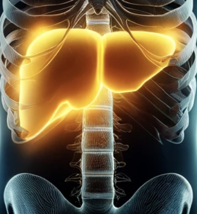
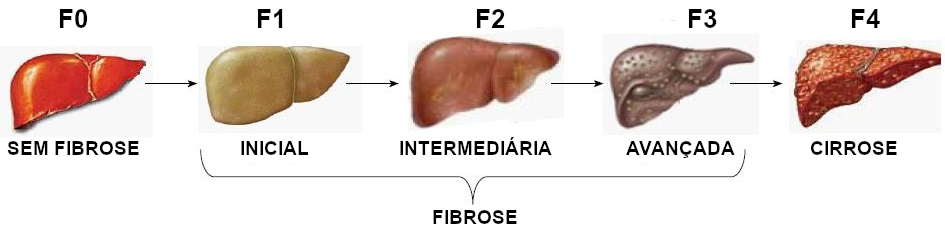
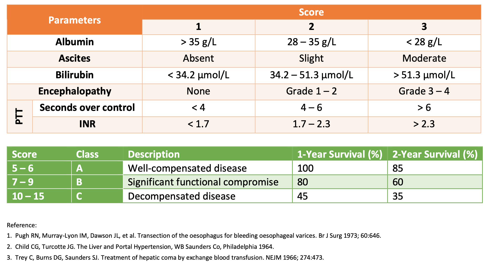
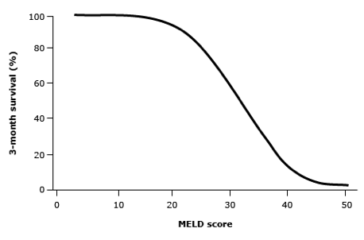

<style>
section {
  font-size: 34px;
}
section::after {
  content: attr(data-marpit-pagination) '/' attr(data-marpit-pagination-total);
  font-size: 16px;
}
</style> 
<style scoped>
h3 {color: #ff9900;}
section {
    background-color: #333333;
  }
</style>


I Simpósio de Transplante Hepático do Hospital São José
### Cirrose Hepática
##### Manejo Pré Operatório de Paciente Cirrótico em Fila de Tx
Everton Berger 

<!-- footer: <b>Graduação em Medicina pela UNESC<br>Residencia em Clinica Médica pelo HNSC (SC) <br>Residência em gastroenterologia pelo HUSM (RS)<br>Professor do Curso de Medicina (UNESC)<br> Chefe do Serviço de Gatsroenterologia e Endoscopia Digestiva Hospital São José (SC)</b> -->

<!--
Boa [manhã/tarde], Obrigado pelo convite, hoje vou apresentar uma visão geral sobre cirrose em adultos, focando no manejo geral e prognóstico até que haja a necessidade de transplante hepático. A cirrose é uma condição complexa que exige uma compreensão profunda tanto para seu tratamento quanto para a prevenção de suas complicações.
Mas antes de mais nada vamos falar do que o que é cirrose, patologia que afeta o figado o maior órgão sólido do corpo humano com 1,2-1,5 kg. Pode ser dividio em dois lobos e em até 8 segmentos totalmente funcionais.

-->

---

<!--paginate: true -->
## Definição

- Condição caracterizada por fibrose e formação de nódulos regenerativos que levam à deterioração progressiva das funções hepáticas.

- Considerada ***normalmente*** irreversível em estágios avançados.

- Expectativa de vida reduzida e sucetíveis a uma variedade de complicações.
<!-- footer: ""-->
<!--
- A cirrose representa um estágio tardio de fibrose hepática progressiva caracterizada pela distorção da arquitetura hepática e pela formação de nódulos regenerativos. 
- É geralmente considerada irreversível em seus estágios avançados, momento em que a única opção de tratamento pode ser o transplante de fígado.
- Entretanto a melhora da fibrose já foi documentada (quando em estágios iniciais) em diversas formas de doença hepática após o tratamento da causa subjacente. 

Estes pacientes são suscetíveis a uma variedade de complicações e sua expectativa de vida é acentuadamente reduzida.
-->
---

## Progressão da Fibrose
<script type="module">
  import mermaid from 'https://cdn.jsdelivr.net/npm/mermaid@10/dist/mermaid.esm.min.mjs';
  mermaid.initialize({ startOnLoad: true });
</script>
<br>

<div class="mermaid">
  graph LR;
  a["Genética "];
  b["Metabólica "];
  c["Externas (Álcool) "];
  d["Inflamação / Colestase Crônica "]; 
  e["Fibrose hepática "];
  f["Fatores Etiológicos: "];
  style f fill:#0a644b, stroke:#000000,stroke-width:1px,color:#ffffff;
  style e fill:#de4050, stroke:#000000,stroke-width:1px,color:#ffffff;
  style d fill:#de7b40, stroke:#000000,stroke-width:1px,color:#ffffff;
  f --> a <--> b; b <--> c;
  d --> e;
</div>
<br>


<!--
A inúmeras causas de doença hepática que podem resultar em cirrose, seja por causar inflamação ou colestase.
Podemos observar a progressão da quantidade de fibrose pelo score de Metavir onde a inflamação crônica do tecido hepático leva a graus progressivos de Fibrose e Alteração da arquitetura hepática.
-->

---

<style scoped>
table {
  font-size: 18px;
}
p {color: rgb(209, 138, 23)}
</style>
## Etiologia

| <p>Causas Comuns</p> | <p>Causas Menos Comuns</p>                     |
|:-------------------- |:---------------------------------------------- |
| **Hepatites Virais** | Hepatite Autoimune                             |
| **Álcool**           | Cirrose Biliar Primária                        |
| **NASH**             | Colangite Esclerosante                         |
| **Hemocromatose**    | Medicações (Metrotexato, isoniazida, etc)      |
|                      | Doença de Wilson                               |
|                      | Deficiênciua de alfa-1 antitripsina            |
|                      | Doença Celiaca 	                              |
|                      | Ductopenia Idiopática do Adulto                |
|                      | Doença Hepática                                |
|                      | Fibrose Portal Idiopática 	                    |
|                      | Infecção (Sífilis, Brucelose, equinococos, etc)|
|                      | Insuficiência Cardiaca Direita                 |
|                      | Doença Veno-Oclusiva                           |

<!-- footer: <b>Charlton MR, Kondo M, Roberts SK, et al. Liver transplantation for cryptogenic cirrhosis. Liver Transpl Surg 1997; 3:359</b> -->
<!--
- Nos paises em desenvolvimento as principais causas são Hepatite Virais, o Álcool e a Esteato hepatite não-Alcóolica que representam aproximadamente a 80% dos pacientes em lista de espera para transplante entre os anos 2004 e 2013.

- A etiologia específica pode ser determinada em até 90% das vezes. 

- Determinar a etiologia é importante pois pode influenciar a decisão do tratamento, permite o conselho para os familiares e permite o seu prognóstico.
-->

---
## Número de Casos Mundo


<!-- footer:  <b>Lancet. 2012 Dec 15; 380(9859): 2095–2128. doi: 10.1016/S0140-6736(12)61728-0</b> -->


<!--
Esta imagem nos mostra as causas de morte globais em um espaço de 20 anos em todo mundo, a cirrose permance responsável como a 12a causa de morte no período, entretando quando observados a causa de morte por neoplasias hepática que subiu de 24o ao 16a posição no ranking. 

-->

---
## Número de Casos Brasil

- 8ª (oitava) causa de morte geral.

- Causas:
  - Alcóolica (15%),
  - Neoplasia (13%),
  - Outras causas (26%).

- Maior prevalência de internações e mortes na região Sul do Brasil

<!-- footer:  <b>Liver Int. 2014: 34: 844–849. DOI:10.1111/liv.12470</b> -->
<!--
Já no Brasil a Cirrose é considerada a 8a causa de morte geral, sendo principalmente decorrente de causas alcóolicas e por neoplasia hepática. Sendo a maioria das vezes não determinadas e ai consideram-se as criptogênicas, por hepatites virais, e por esteatohepapite não alcóolica que é uma causa que vem aumentando principalmente em paises desenvolvidos.

-->

---


## Quando pensar em Cirrose? 
- Estigmas de doença hepática crônica no exame físico. 

- Evidência de cirrose em testes laboratoriais ou radiológicos ou por visualização direta durante um procedimento cirúrgico.

- Evidência de cirrose descompensada, caracterizada pela presença de complicações.

<!-- footer: ""-->

<!--
O quadro clinico do paciente com cirrose é muito florido o paciente pode apresentar uma variedade de sinais e sintomas desde sintomas inespecíficos até alterações que sugerem doença mais avançada. Normalmente observados alguns estigmas de doença hepática cronica. Evidências de cirrose em testes laboratoriais e radiológicos e até evidência de cirrose descompesada.
-->

---
<style scoped>
table {
  font-size: 17px;
}
b {color: #FF9900;}
</style>
## Manifestações Clínicas
| <b>Sintomas</b> | <b>Exame Físico</b> | <b>Laboratório</b> | <b>Imagem</b>    |
|:--------------- |:------------------- |:------------------ |:---------------- |
| Anorexia        | Hepatomegalia       | AST/ALT > 1        | Nodularidade superficial|
| Perda de peso   | Esplenomegalia      | Fosfatase Alcalina 2-3x| Aumento da ecogenicidade|
| Fraqueza/Fadiga | Telangiectasias     | Gama-GT elevado        | Atrofia do lobo direito|
| Cãibras         | Eritema palmar      | Trombocitopenia        | Hipertrofia lobo esquerdo|
| Contusões       | Alargamento Digital | Leucopenia/neutropenia | Fígado pequeno e nodular*|
| Amenorréia      | Osteoartropatia     | Anemia                 | **Ascite*** |
| Impotência      | Cont. de Dupuytren  | **Albumina baixa***        | **Carcinoma hepatocelular***|
| Infertilidade   | Ginecomastia (homens)| **TP/INR alargado***      | Trombose da veia porta |
| **Icterícia***  | Perda de pelos      | **Hiponatremia***          | **Colaterais portossistêmicos***|
| **Urina escura*** | Atrofia testicular  | **Creatinina elevada***            |                  |
| **Prurido***      | **Icterícia***          |         |                  |
| **Hemorragias***  | **Ascite***             |         |                  |
| **Distensão Abd***| **Asterix***            |         |                  |
| Edema MMIISS    | **Hálito Hepático***    |         |                  |
| **Confusão***     |        |        |             |
| **Distúrbio Sono***|        |        |             |

<!-- footer:  <b>(*) Sugere doença avançada ou desenvolvimento de uma complicação grave.</b> -->


<!--
As manifestações clínicas da cirrose podem incluir sintomas inespecíficos (por exemplo, anorexia, perda de peso, fraqueza, fadiga) ou sinais e sintomas de descompensação hepática (icterícia, prurido, sinais de sangramento gastrointestinal, distensão abdominal por ascite, confusão devido a encefalopatia hepática). (tabela )

Os achados do exame físico podem incluir icterícia, ginecomastia, ascite, esplenomegalia, eritema palmar, baqueteamento digital e asterixe. Anormalidades laboratoriais podem incluir bilirrubina sérica elevada, aminotransferases anormais, fosfatase alcalina/gama-glutamil elevadas. tempo de protrombina prolongado/relação normalizada internacional (INR) elevada, hiponatremia, hipoalbuminemia e trombocitopenia.
-->

---
<style scoped>
section {
  font-size: 35px;
}
h2 { font-size: 64px; }
b {color: #FF9900;}
</style>
## Progressão e História Natural


- Prognóstico altamente variável, influenciado por fatores como etiologia, severidade e presença de complicações.

- **Cirrose Compensada:**
  - Pacientes sem complicações maiores têm sobrevida mediana superior a 12 anos.
  - <font color="#dd0055">58% vão descompensar nos primeiros 10 anos de acompanhamento.</font>

<!-- footer: ""-->
<!--
Cirrose Compensada: Pacientes com cirrose que não desenvolveram complicações maiores têm uma sobrevida mediana superior a 12 anos. Aqueles com varizes que ainda não apresentaram sangramento varicoso também são classificados como compensados, embora sua taxa de mortalidade em um ano seja pior (3,4%) em comparação com pacientes que têm cirrose compensada sem varizes (1,0%) .
-->
---

## Progressão e História Natural

- **Cirrose Descompensada:** Presença de complicações:
  - Hemorragia varicosa, 
  - Ascite,
  - Peritonite Bacteriana Espontânea (PBE),
  - Encefalopatia hepática,
  - Carcinoma Hepatocelular (HCC),
  - Síndrome Hepatorrenal,
  - Síndrome Hepatopulmonar.

<font color="#dd0055"> ↳  Fatores de Desconpensação</font>
```
Sangramento, Infecções, Consumo de Álcool, Medicações, Desidratação e Constipação
```
<!-- footer: "Am J Gastroenterol 2011; 106:96."-->

<!--

- Cirrose Descompensada: Pacientes com complicações de cirrose, como hemorragia varicosa, ascite, peritonite bacteriana espontânea, carcinoma hepatocelular, síndrome hepatorenal ou síndrome hepatopulmonar, têm um prognóstico significativamente pior.

- O prognóstico da cirrose é altamente variável, uma vez que é influenciado por vários fatores, incluindo etiologia, gravidade, presença de complicações e doenças comórbidas (por exemplo, o paciente desenvolve sangramento por varizes, encefalopatia hepática ou peritonite bacteriana espontânea). as taxas de mortalidade são altas
-->
---
## Escores Preditivos: Child-Pugh




<!-- footer: ""-->
<!--
1. Classificação Child-Pugh

Descrição: Este modelo usa cinco parâmetros clínicos e bioquímicos para classificar a gravidade da cirrose em três classes: A (leve), B (moderada) e C (grave).

Utilidade: Avalia o risco cirúrgico e prognóstico a longo prazo. Por exemplo, a taxa de sobrevida em um ano para pacientes com cirrose Child-Pugh classe A é aproximadamente 100%, para classe B cerca de 80%, e para classe C aproximadamente 45% . -->

---
## Escores Preditivos: MELD 


- Utilizado para priorizar candidatos a transplante de fígado com base em critérios laboratoriais (Formula matématica [Bilirrubina, Creatinina, INR, Sódio])
- Prediz a mortalidade em 3 meses.



<!--
2. Escore MELD (Model for End-Stage Liver Disease)

Descrição: Utiliza níveis de bilirrubina, creatinina e INR para calcular um escore numérico que prediz a mortalidade em três meses de pacientes com doença hepática terminal.

O MELD original foi adaptado para priorizar pacientes na lista de transplante de fígado e também é usado para prever resultados em cenários não transplantados.

Auxilia na priorização para transplante de fígado e na avaliação de risco em várias situações clínicas.

Referência para Especialista: Pacientes com um escore MELD ≥10 são frequentemente encaminhados para avaliação em centros de transplante.

Estes modelos são essenciais para o manejo de pacientes com cirrose, ajudando a tomar decisões clínicas informadas quanto ao tratamento, necessidade de transplante e acompanhamento médico.
-->

---

## Importância dos Escores
- Quanto pior os escores mais chances de descompensação clínica.
- Sobrevida média de ≤ 6 meses para um Child-Pugh ≥12 (C) ou escore MELD ≥21.

- Definir quais pacientes necessitam cuidados mais precocemente.

<!-- footer: "Am J Med 2012; 125:512.e1."-->

<!--

Uma revisão sistemática indicou que a sobrevida mediana é de ≤6 meses para pacientes com cirrose descompensada e um escore Child-Pugh ≥12 ou escore MELD ≥21. Além disso, a mortalidade geral foi de 39%, aumentando para 48% em pacientes que desenvolveram uma segunda infecção durante a internação .

-->


---
## Objetivos Gerais

- Retardar ou reverter a progressão da doença hepática.

- Prevenir insultos sobrepostos ao fígado.

- Identificar medicamentos que requerem ajustes de dose ou que devem ser totalmente evitados.

- Manejar sintomas e anormalidades laboratoriais.


<!-- footer: ""-->

<!-- 
Retardar ou reverter a progressão da doença hepática — Embora a cirrose seja geralmente considerada irreversível nas suas fases avançadas, o ponto exato em que se torna irreversível não é claro [14,15]. evoluiu para cirrose. Portanto, terapias específicas direcionadas contra a causa subjacente da cirrose devem ser instituídas.
--> 
---
## Objetivos Gerais

- Prevenir, identificar e tratar as complicações da cirrose.

- Estabelecer a real necessidade do Tx, levando em consideração a etiologia, o grau de disfunção da doença hepática, bem como, a ausência de tratamento conservador com melhor resultado na probabilidade de sobrevida comparado ao transplante.


<!-- footer: ""-->

<!--
O objetivo principal das consultas nesta fase é o de identificação e tratamento precoce das complicações
da cirrose hepática, caracterizadas pela presença de: ascite, EH, HDA, PBE, insuficiência renal, desnutrição e
infecções em geral. Este acompanhamento ambulatorial servirá também para esclarecimento ao paciente das suas
dúvidas, bem como das complicações e mortalidade do Tx. 

Após inclusão em lista, o paciente será seguido ambulatorialmente pelo hepatologista com freqüência de
consulta que poderá ser semanal, mensal ou trimestral a depender de cada paciente.
-->

---

## Objetivos Gerais


- O transplante hepático deve ser considerada em todos pacientes com doença hepática terminal.

- Até 80% dos casos podem ser excluídos antes da avaliação formal por razões como alcoolismo ativo ou carcinoma hepatocelular muito avançado.

- Pacientes considerados para transplante uma vez que seu escore **MELD é ≥ 15**. A avaliação é normalmente iniciada quando o escore **MELD é > 10**.


<!-- footer: ""-->

<!--

OBS: A presença de cirrose por si só não justifica o transplante. É considerado quando há complicações significativas de hipertensão portal ou função hepática comprometida, como hemorragia varicosa, ascite e encefalopatia.

Para aqueles que não são candidatos, cuidados paliativos podem ser considerados para pacientes com sobrevida prevista de ≤6 meses.
-->

---

## Complicações: Ascite 

- **Definição:** Acúmulo de fluido no abdômen, uma das complicações mais comuns da cirrose.

- **Manejo:** Tratamento com diuréticos, restrição de sódio e, em casos refratários, paracentese terapêutica.
<br>
<br>
<br>
<!-- footer: ""-->
---

## Importância da Ascite

```
25% dos pacientes com cirrose apresentarão PBE no ano subsequente ao
aparecimento da ascite.
```
```
Apenas 30% dos pacientes que desenvolvem PBE sobrevivem > 2 anos.
```
```
Probablidade do surgimento da síndrome hepatorrenal
- 18% em um ano e 39% em três anos.

Sobrevida após surgimento síndrome hepatorrenal tipo I em 
torno de 1,7 semanas.
```
```
Aproximadamente 40% dos cirróticos hospitalizados por ascite morrerão
em 2 anos se não transplantados.
```

<!-- footer: "Gastroenterology 1993; 104:1133 / Gastroenterol Hepatol 1995;10:47 / Hepatology 1987; 7:122 / Am J Gastroenterol 1993; 88: 514"-->

---
## <!--fit-->Complicações: Hemorragia Digestiva

- **Definicação:** Sangramento normalmente ocasionado por ruptura de varizes esofágicas ou gástricas.

- **Diagnóstico:** Hematêmese ou melena, com risco potencial de vida.

- **Tratamento:** Geralmente tratada com ligadura elástica de varizes. Outros incluem escleroterapia, derivação portossistêmica intra-hepática transjugular (TIPS).
<!-- footer: "Am J Gastroenterol 2011; 106:96."-->
---
## Importância Hemorragia Digestiva

```
Pacientes com varizes, sem sangramento, são considerados como
cirrose compensada. Mas pior prognóstico (taxas de mortalidade
de um ano de 3,4 versus 1,0 por cento)
```
```
Uso de beta-bloqueadores não seletivos com papel na prevenção 
da progressão em pacientes compensados.
```
```
Associada a altas taxas de mortalidade (30%) e 
apenas 1/3 dos pacientes sobrevivem durante um ano.
```
```
Mesmo com tratamento moderno taxas de mortalidade 15-20% em 30 dias.
```

<!-- footer: "J Hepatol 2006; 44:217. / Lancet 2019; 393:1597. / Gastroenterology 1982; 82:968. / Hepatology 2003; 38:599."-->
---
## <!--fit-->Complicações: Peritonite Bacteriana Espntânea

- **Definição:** Infecção do líquido ascítico preexistente sem causa secundária identificável.

- **Diagnóstico:** Febre, dor abdominal e alteração do estado mental. Contagem PNM (≥250 células/mm3) no líquido ascítico.

- **Tratamento:** Antibióticos + Albumina 1º e 3º dias. Sem tratamento precoce mortalidade alta.

<!-- footer: ""-->
<!--

-->
---

## <!--fit-->Complicações: Síndrome Hepatorrenal

- **Definição:** Insuficiência renal rápida decorrente de alterações na função renal induzidas pela cirrose avançada.

- **Diagnóstico:** Baseado em critérios clínicos, excluindo outras causas de insuficiência renal.

- **Tratamento:** Volume plasmático, medicamentos vasoconstritores e, em última instância, transplante de fígado.

<!-- footer: ""-->
---
## <!--fit-->Complicações: Encefalopatia Hepática

- **Definição:** Alterações neuropsiquiátricas devido à incapacidade do fígado doente em remover toxinas do sangue.
- **Sintomas:** Confusão, alterações do sono, mudanças de personalidade e, em estágios avançados, coma.

- **Tratamento:** Administração de lactulose, antibióticos e correção de fatores precipitantes.
<!-- footer: ""-->
---


## <!--fit--> Rastreamento de Hepatocarcinoma (HCC)

- Importância do Rastreamento:
  - **Risco Elevado na Cirrose**
  - **Detecção Precoce**
<br>
- Rastreamento a cada (6) seis meses.

- Ultrassonografia de Abdomen + Alfafetoproteína (AFP)

- RNM ou TC, para pacientes com achados inconclusivos ou em risco muito alto.

<!-- 
A detecção precoce do HCC pode melhorar significativamente a sobrevida e as opções de tratamento disponíveis.

-->
---
## Manejo Geral

- **Medidas Gerais:**
  - Uso criterioso de diuréticos (**Ascite Refratária**)
  - Evitar Inibidores da Bomba de Prótons (IBP). Usar somente com indicação clara (**PBE, Translocação Bacteriana, Encefalopatia**).
  - Evitar sedativos e benzodiazepinicos (**Encefalopatia**).
  - Evitar agentes nefrotóxicos e diurese agressiva (**Síndrome Hepatorrenal**).


<!-- footer: ""-->
<!--
- A hiponatremia é um problema comum em pacientes com cirrose avançada. A patogênese da hiponatremia está diretamente relacionada às alterações hemodinâmicas e às adaptações neuro-humorais secundárias que ocorrem no contexto da cirrose, resultando em uma capacidade prejudicada de excretar a água ingerida. está relacionado à gravidade da cirrose.
- Trombocitopenia ou INR elevado – Pacientes com cirrose frequentemente apresentam contagens baixas de plaquetas e índices normalizados internacionais (INRs) elevados. Como o fígado produz fatores de coagulação, bem como proteínas anticoagulantes, a doença hepática pode levar a um estado de hipocoagulabilidade ou a um estado de hipercoagulabilidade.

-->
---
## Manejo Geral

- **Alterações Laboratoriais:** 
  - Corrigir hiponatremia e hipocalemia, sempre que possível (Síndrome Hepatorrenal).
  - Plaquetopetia e INR alargado - objetivo (pelo menos 50.000/microL plaquetas).

- **Hipotensão e Insuficiência adrenal Relativa:** PAM ≤82 mmHg foi um importante preditor de sobrevida.

- **Estatinas:** podem retardar a progressão da fibrose, prevenir a descompensação hepática e reduzir a mortalidade.


---
## Manejo Geral


- **Sangramento por Varizes –** Rastrear varizes de esôfago com EDA em pacientes com hipertensão portal e uso de beta-bloqueadores.
- **Carcinoma hepatocelular –** Realizar vigilância a cada 6 meses.
- **PBE -** Diuréticos, antibióticos profiláticos se proteína do liquido ascítico baixo.
- **Encefalopatia hepática –** Alterações iniciais sutis. (uso de **Lactulona, Hepa-Merz©, Metronidazol**).
- **Trombose de Veia Porta –** Otimização da função hepática e redução da pressão venosa portal.
<!-- footer: ""-->
<!--
-->


---
## Em que Momento Fazer o Tx?

Gravidade da Doença - Oferta / Demanda órgãos
```
O transplante hepático deverá ser realizado
enquanto o paciente estiver suficientemente
bem para superar o procedimento/processo, mas
em estágio evolutivo da doença em que seja improvável
sobreviver sem o transplante.
```
```
Para cada paciente transplantado cerca de 20-50 doentes
morrerão de doenças hepáticas sem receber um transplante
e a maioria nem será avalida para o procedimento.
```

---

## Tx Hepático: Avaliação

1. ***<font color="#BC8D1F">Deve haver indicação racional  além do dx de cirrose e de escore (MELD) que qualifique o paciente para ser listado.</FONT>***

2. ***<font color="#BC8D1F">Entender a dinâmica de acesso ao transplante:</font>***
    - **MELD**
    - CHC dentro dos critérios de Milão II - tumor >= a 2 cm de diâmetro, dentro dos critérios de Milão com dx baseado nos critérios de Barcelona e sem indicação de ressecção.
    - Complicações da cirrose que não refletem no MELD (Ascite, Encefalopatia, D. Colestáticas). 
---

## Tx Hepático: Avaliação


3. ***<font color="#BC8D1F">Contraindicações ao Transplante hepático no Brasil:</font>***
    - Doença alcoólica com menos de 6 meses de abstinência.
    - Infecção extra-hepática não controlada.
    - Polineuropatia amiloidótica familiar avançada.
    - Doença cardíaca ao pulmonar avançada (não relacionada à hepatopatia).
    - Tumor metastático (salvo neuroendócrino).

    - *Idade > 70 anos. (Câmara técnica)*

---

## Tx Hepático: Avaliação


4. ***<font color="#BC8D1F">Avaliar outras possíveis contraindicações:</font>***
    - Trombose porto-mesentérica completa.
    - AIDS. *--> (Não formal se carga viral- e CD4 > 250)*
    - Neoplasia extra-hepática.
    - Suporte social inadequado.
    - Uso ativo de drogas ilícitas.
    - Obesidade (ponto de corte IMC 35-40).
    - Má nutrição (ponto de corte IMC < 19-20).
<br>
4. ***<font color="#BC8D1F">Confirmar o interesse do paciente em realizar o procedimento.</font>***
---
<style>
    .columns {
    display: grid;
    grid-template-columns: repeat(2, minmax(0, 1fr));
    gap: 0rem;
  }
</style>
## Obrigado!

<div class="columns">
<div>


</div>
<div>
<br>
<br>

```
     evertonberger@gmail.com
```

</div>